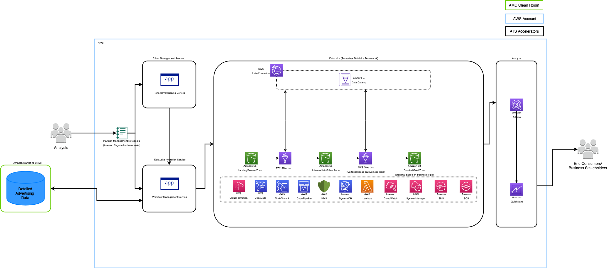

# AMC Analytics Delivery Kit
The AMC Analytics Delivery kit is a quick start accelerator for advertising customers to start working the the Amazon Marketing Cloud (AMC) and execute custom, value-driven use cases for measuring their media campaigns with Amazon. 
The purpose of the delivery kit is to enable more self-service analytics for customers.

**Contents:**

* [Reference Architecture](#reference-architecture)
* [Modules Deployed](#modules-deployed)
* [Prerequisites](#prerequisites)
* [Steps To Deploy](#steps-to-deploy)
* [Amazon QuickSight Dashboards](#amazon-quicksight-dashboards)
* [FAQs](#faqs)


## Reference Architecture


## Modules Deployed
  1. [Serverless Datalake FrameWork](DataLake/ServerlessDatalakeFramework/aws-serverless-data-lake-framework/README.md)
  2. [Tenant Proviousing Service](CustomerManagementService/TenantProvisioningService/sdlf-tps-pipeline/README.md)
  3. [Workflow Management Service](DataLakeHydrationMicroservices/WorkflowManagerService/sdlf-wfm-pipeline/README.md)
  4. [Platform Management Notebooks](PlatformManagementNotebooks/README.md)

## Prerequisites
1. AWS Account
2. Setup [aws profile](https://docs.aws.amazon.com/cli/latest/userguide/cli-chap-configure.html) to access aws account from local system. Preferably admin access or using a role which has admin access.
3. Install [git](https://github.com/git-guides/install-git) if you don't have it already.
4. Install [aws cli](https://aws.amazon.com/cli/).
5. Need to be on Amazon VPN.

## Steps To Deploy
* Create a folder. The below instructions are for Mac OS but the same equivalent are avilable for other OS.
```
   mkdir amc-delivery-kit-repo
```
* Go to the folder
```   
   cd amc-delivery-kit-repo
```
* Clone repo to local. you might need ot enter your password on running the below command.
```   
   git clone ssh://git.amazon.com/pkg/AMC-Analytics-Delivery-kit --branch develop
```
* Go to the repo folder
```   
   cd AMC-Analytics-Delivery-kit
```
* Setup terminal rsa token to run aws cli commands by running the below command and follow the instructions.
```
   mwinit -o
```
* Test the connectivity with the AWS account using the below command.
```   
   aws s3 ls --profile <profile name setup in Pre-requisite step 2>
```
* Run the following commands. It will create a Amaozn S3 bucket to copy the code base which cloned in Step 3 and launch the deployment of the different AMC Analytics Delivery Kit modules.
```
   chmod +x prerequisite.sh
   ./prerequisite.sh -s <profile name setup in Pre-requisite step 2> -r us-east-1
```
* Monitor the [AWS CloudFormation](https://console.aws.amazon.com/cloudformation/home?region=us-east-1), [AWS CodeBuild](https://console.aws.amazon.com/codesuite/codebuild/projects?region=us-east-1) and [AWS CodePipeline](https://console.aws.amazon.com/codesuite/codepipeline/pipelines?region=us-east-1) in us-east-1 region and should not have any errors or failures. It will take approximate 90 minutes.
* Once finished go to [Amazon Athena](https://console.aws.amazon.com/athena/home?region=us-east-1) [switch the role](https://docs.aws.amazon.com/IAM/latest/UserGuide/id_roles_use_switch-role-console.html) on the top right to @<teamname>-saw-datalake-users-<region>, Ex. - @demoteam-saw-datalake-users-us-east-1.
   If using the default settings of the module, put the Account Id the same as the AWS Account Id being used.
   The Role name should be @demoteam-saw-datalake-users-us-east-1. Switch [Amazon Athena workgroup](https://docs.aws.amazon.com/athena/latest/ug/workgroups-create-update-delete.html) to <teamname>-<application name>-<environment>-workgroup, EX - demoteam-demodl-dev-workgroup.
* Run the below queries to explore the sample AMC datasets
```
   SELECT * FROM "demoteam_amcdataset_dev_stage"."testdemocustomer_audience_analysis_adhoc" limit 10;
   SELECT * FROM "demoteam_amcdataset_dev_stage"."testdemocustomer_device_exposure_adhoc" limit 10;
   SELECT * FROM "demoteam_amcdataset_dev_stage"."testdemocustomer_frequency_distribution_adhoc" limit 10;
   SELECT * FROM "demoteam_amcdataset_dev_stage"."testdemocustomer_geo_analysis_adhoc" limit 10;
   SELECT * FROM "demoteam_amcdataset_dev_stage"."testdemocustomer_product_mix_adhoc" limit 10;
```

## Amazon QuickSight Dashboards
Below are some sample QuickSight Dashboards built using the sample AMC datasets:
1. Audience Analysis
   * This dashboard provides analysis on audience segments targeted by the customer and also details of audience segments 
     that user was a part of but not targeted for purchases of customer products on Amazon.
2. Frequency Distribution
   * This dashboard provides analysis on performance and delivery by different frequencies/impression exposures to help 
     optimize campaign frequency caps to maximize conversion likelihood for purchases of assigned customer products on Amazon.
3. Device Exposure
   * This dashboard helps to determine performance metrics (i.e., ROAS, Impressions, Conversions, Clicks) across device
     types (e.g., TV, Mobile, PC, Tablet) for purchases of assigned customer products on Amazon. 
4. Geo Analysis
   * This dashboard provides analysis on performance data by geographic location (e.g.DMA) for purchases of assigned 
     customer products on Amazon.
5. Product Mix Analysis
   * This dashboard provides performance data of users exposed to both sponsored products (SP) and display 
     campaigns (DSP) and KPIs surrounding them. 

## FAQs
1. Multiple AWS CodeBuilds are failing ?
    1. As part of the AMC Analytics Delivery Kit deployment, four AWS CodeBuilds are concurrently invoked. For a brand new AWS account, you might see a scenario where multiple AWS CodeBuilds are in Queued status and eventually failing. Please reach out to AWS support to increase the concurrent AWS CodeBuild run limits